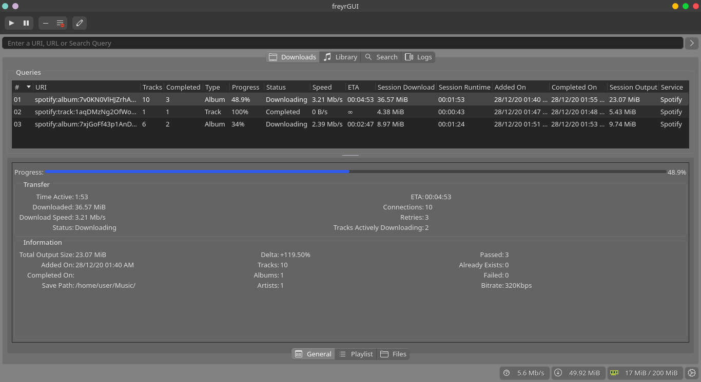
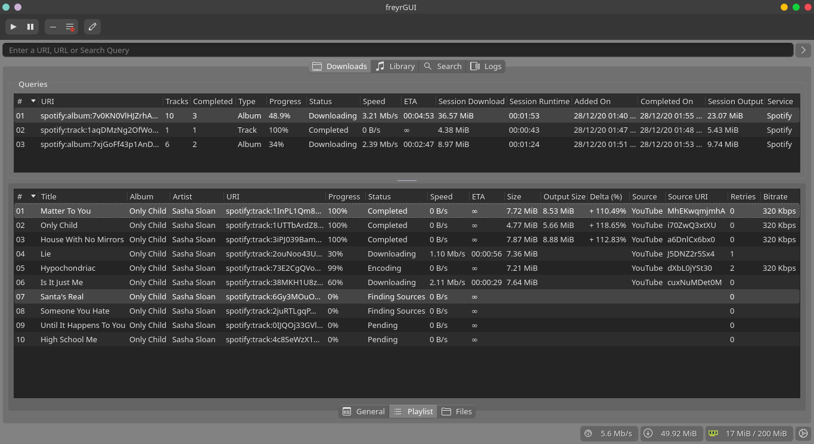
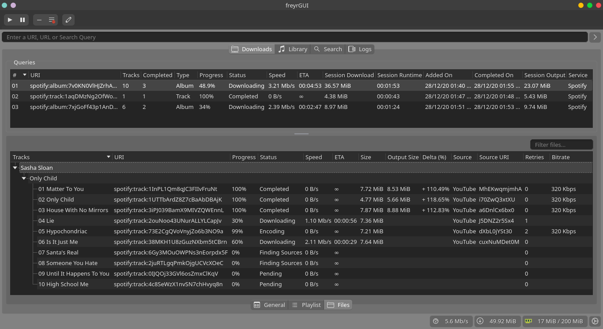
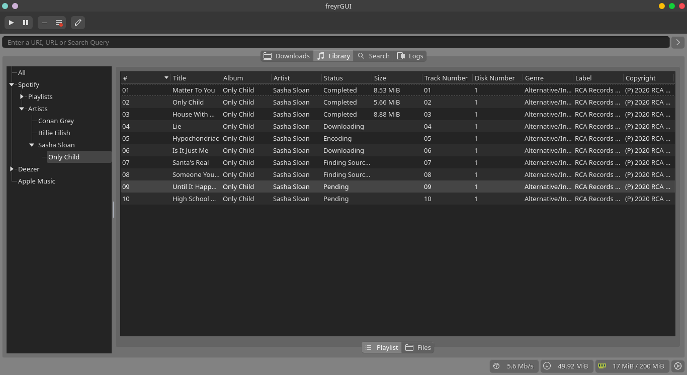
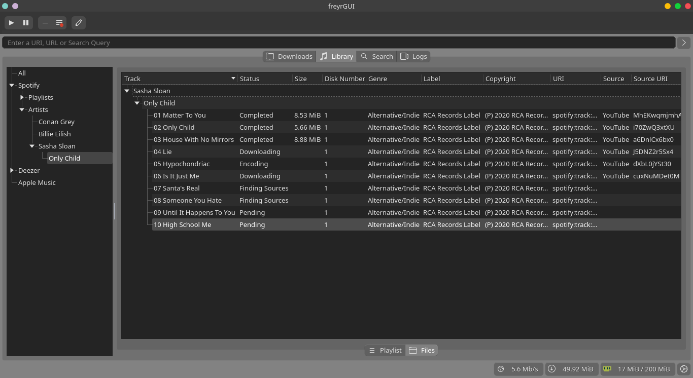

# freyr-gui

A cross-platform front-end GUI for freyr-js written in Rust

> This is a mockup (just UI). For visualizing the intended project.

## Setup

Ensure you have Rust installed via the recommended `rustup` installation method <https://www.rust-lang.org/tools/install>

``` bash
# Clone this repo
git clone https://github.com/miraclx/freyr-gui freyr-gui
cd freyr-gui

# Run the preview
cargo run --release
```

## Screenshots







## License

[Apache 2.0][license] © **Miraculous Owonubi** ([@miraclx][author-url]) \<omiraculous@gmail.com\>

[license]:  LICENSE "Apache 2.0 License"
[author-url]: https://github.com/miraclx
